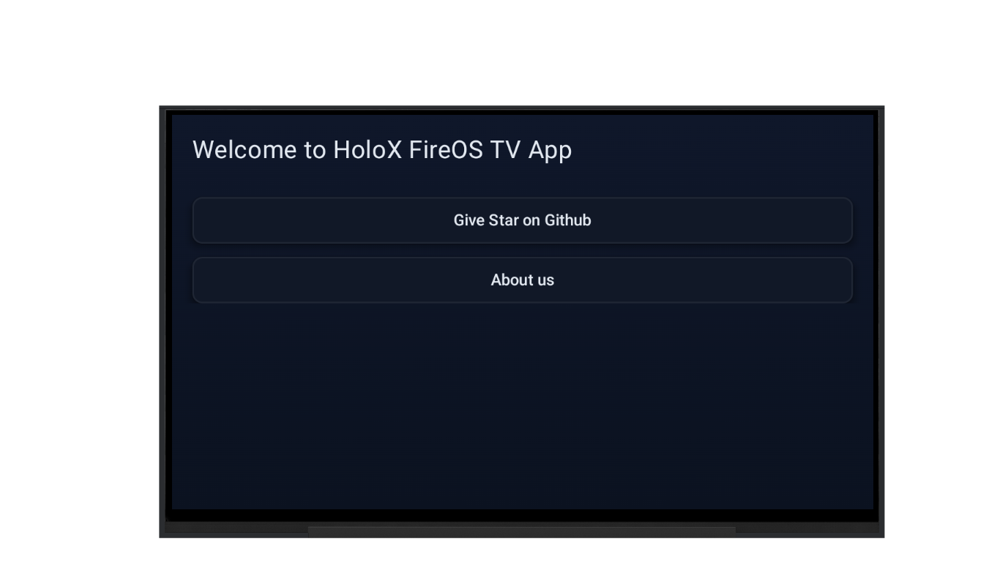
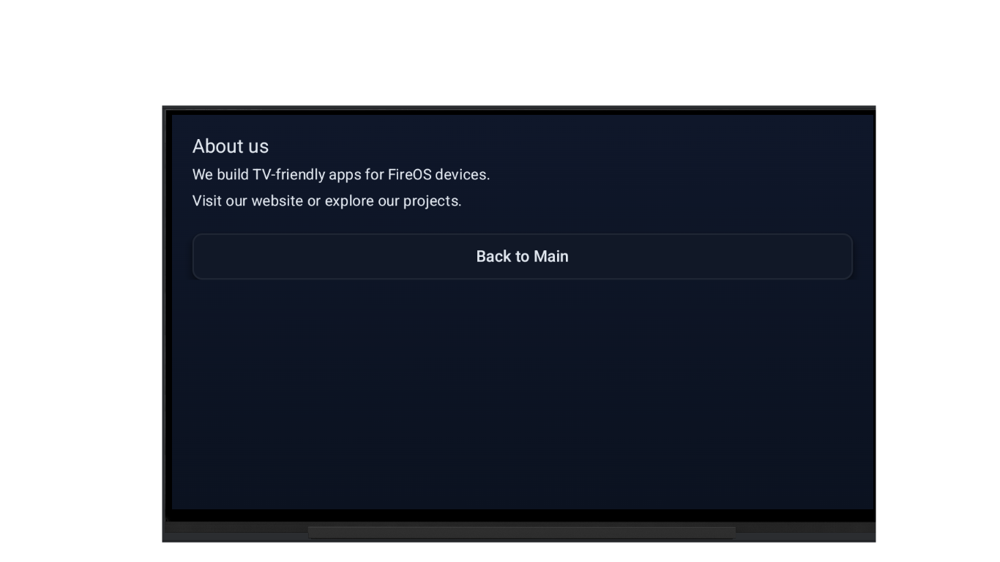

# HoloX FireOS TV App (SOD-10)

A simple, TV-friendly Android app for **Amazon Fire OS / Fire TV** built with **Kotlin + Jetpack Compose**.  
This project is the native Android counterpart of our FireOS Apps and keeps the same visual style and remote-control friendly UX. :contentReference[oaicite:1]{index=1}

---

## 📱 App Screenshots
| Home Screen | About Screen |
|-------------|--------------|
|  |  |

---

## Features

- **D-pad Friendly Navigation**  
  Buttons are focusable and can be navigated smoothly using Fire TV remote arrows (D-pad) and activated with Enter/Select.

- **Two-Screen Simple UI (Main / About)**  
  Lightweight navigation using Compose Navigation—no XML, no fragments.

- **TV Optimized UI**  
  Large typography, high-contrast colors, card-style buttons, focus glow/scale effects.

- **Leanback Compatible**  
  Proper TV manifest features + banner support for Fire TV launcher. :contentReference[oaicite:2]{index=2}

- **External Support Link**  
  “Give Star on Github” button opens a configurable URL in the system browser.

---

## Tech Stack

- **Language:** Kotlin  
- **UI:** Jetpack Compose (Material3)  
- **Navigation:** Navigation-Compose  
- **Target:** Fire OS / Android TV devices

---

## Project Structure

```
FireOS-TV-App/
    └─ src/main/
    ├─ AndroidManifest.xml
    ├─ res/
    │ ├─ values/strings.xml
    │ ├─ values/themes.xml
    │ └─ drawable/tv_banner.png
    └─ java/HoloX/fireos_tv_app/
    ├─ MainActivity.kt
    └─ ui/theme/
    ├─ Color.kt
    ├─ Theme.kt
    └─ Type.kt
```

---

## Prerequisites

- Android Studio (Flamingo / Giraffe / Hedgehog or newer)
- Android SDK Platform **35**
- JDK **17**
- Amazon Fire TV / Fire OS device (or any Android TV) for testing :contentReference[oaicite:3]{index=3}

---

## Build & Run

1. Clone:
   ```bash
   git clone https://github.com/HoloX-co/SOD-10.git
   cd SOD-10
   ```

2. Open in Android Studio.

3. Sync Gradle and run on:

    - Fire TV device (ADB)

    - Android TV emulator

